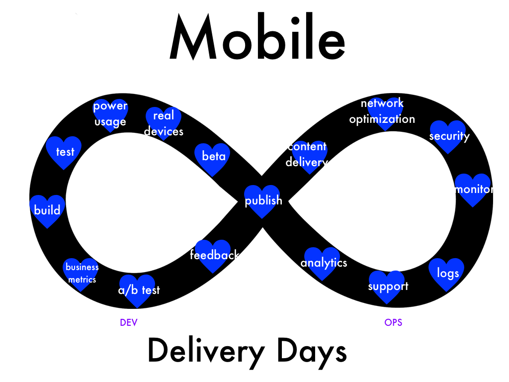

## What is it?
It's early days for mobile app delivery and operations. The tools and methods are still developing and detailed technical stories are hard to find. We believe we need to start talking about the complete mobile delivery story.

## When and where is it?
Join us [March 21-22 2016 in San Francisco](/location) to talk about everything from testing to publishing to running in production to supporting and delivering business insights.

## How do I sign up?
Registration starts February 15th, and attendance is free. Space is very limited, so mark your calendars. [Lean more](/register)!

## Can I speak?
Yes, call for speakers is open! [Come share your knowledge, learn from your peers, advance our field](/propose).

## Can my company help out?
Yes, we're looking for sponsors. [Learn more](/sponsor)!

## Who's putting this together?
A [motley crew](/contact) of folks that think it's about time to have a conference dedicated specifically to mobile application delivery.